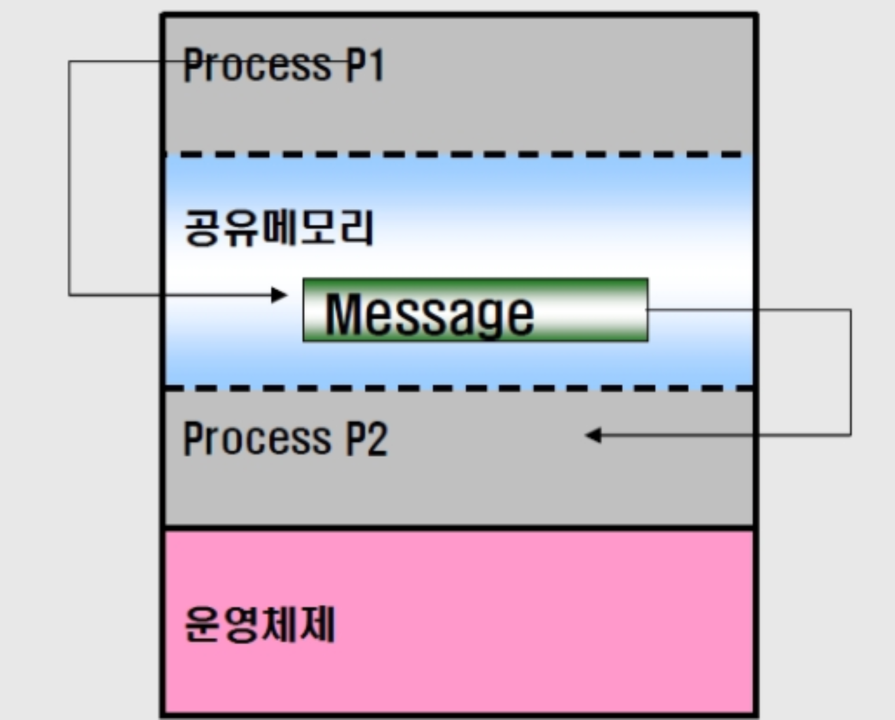
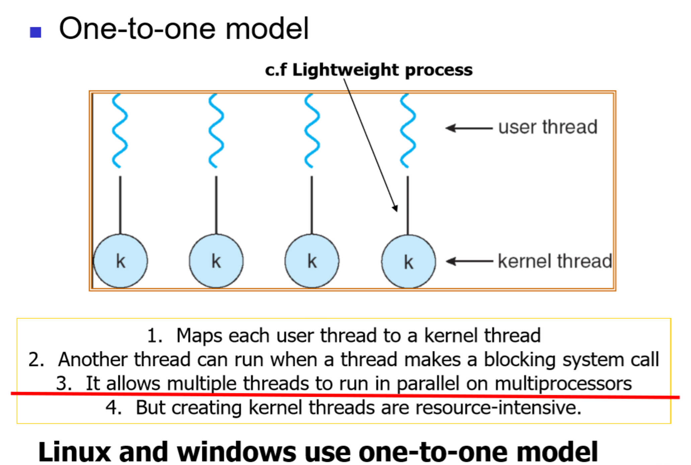
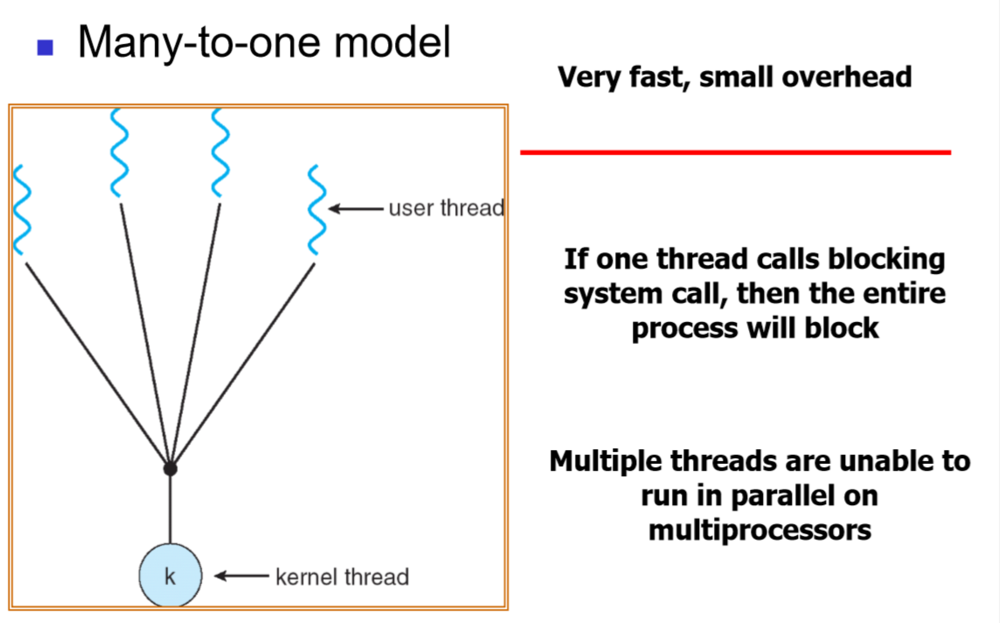
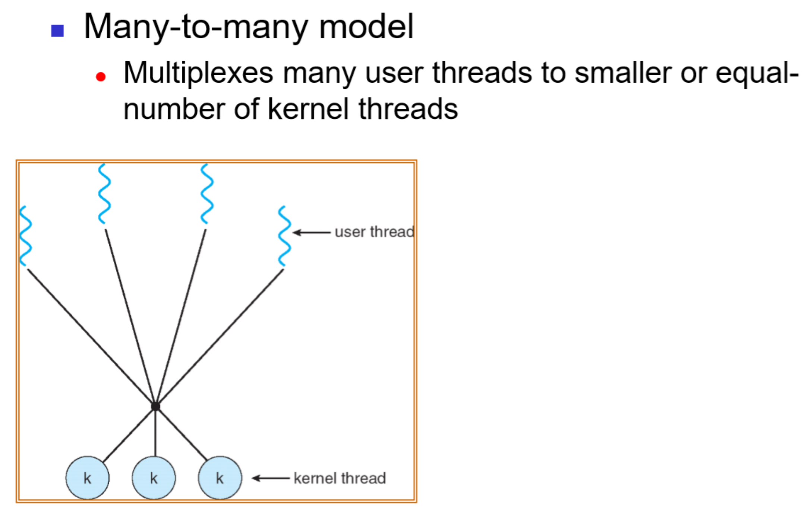
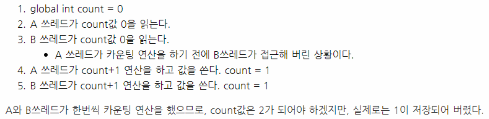
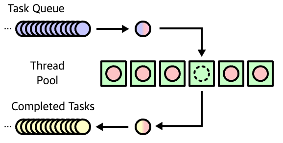
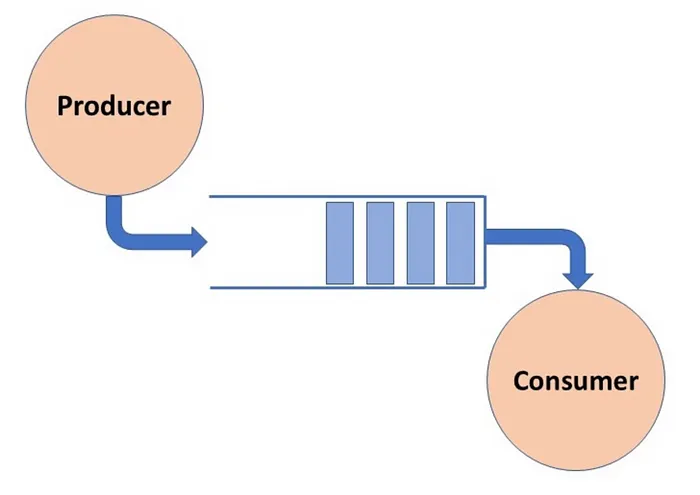

== Thread 란?
[%hardbreaks]
어떠한 프로그램 내에서, 특히 프로세스 내에서 실행되는 흐름의 단위
일반적으로 한 프로그램은 하나의 쓰레드를 가지고 있다
프로그램 환경에 따라 둘 이상의 쓰레드를 동시에 실행할 수 있다
이를 멀티쓰레드(Multithread)라 한다
쓰레드는 Code, Data, File, Register, Stack 부분을 할당 받는다 (Process와 유사)
Program Counter도 따로 할당 받는다

== MultiThread
[%hardbreaks]
* Process 와 Thread 간의 차이점

각각의 Process는 Resource를 전부 독립적으로 할당 받지만, Thread는
Register, Stack만 독립적으로 할당 받고(변수 처리 등을 위하여), Code,
Data, File은 공유한다. 공유 영역에서는 System Call 호출 횟수가 적어지
면서 자연스럽게 Context Switch도 덜 발생하므로 여러 개의 프로그램이
멀티 쓰레드 형태로 동작할 때가 멀티 프로세스 형태로 동작할 때보다
동기화에 더 유리하다

* Multithread의 이점 (앞에서 설명했던 것을 3가지 이점으로 분류)
1. 반응성 / 민감성(Responsiveness)
2. 자원 공유(Resource Sharing)
3. 경제성(Economy)

* Process 와의 차이점

멀티 스레드는 프로세스 한 개 내부에 존재하는 것이므로 각자 스레드간의 메모리를 공유할 수 있지만
멀티 프로세스는 각 프로세스가 독립적이므로 별개의 메모리를 차지하고 있습니다.
그렇기에 Shared memory를 이용하여 프로세스간의 공유 할 수 있는 메모리 공간을 만들어 공유를 해야합니다.
프로세스 간의 전환속도는 스레드 보다 느립니다.
독립적 이므로!!

* Thread의 종류
- Kernel Thread(쓰레드를 생성해주는 곳이 Kernel)
- User Level Thread(쓰레드를 생성해주는 곳이 User Level)

== Multithread Model

* 일-대-일(One-to-One)

사용자 스레드들을 각각 하나의 커널 스레드로 매핑시키는 방식이다. 사용자
스레드가 생성되면 그에 따른 커널 스레드가 생성되는 것이다.
이렇게 하면 다-대-일 방식에서 시스템 호출 시 다른 스레드들이 중단되는 문제를 해결할 수 있으며 여러 개의 스레드를 다중처리기에 분산하여 동시에
수행할 수 있는 장점이 있다.
그러나 커널 스레드도 한정된 자원을 사용하므로 무한정 생성할 수는 없기 때문에, 스레드를 생성할 때 그 개수를 염두에 두어야 한다

* 다-대-일(Many-to-One)

여러 개의 사용자 수준 스레드들이 하나의 커널 스레드(프로세스)로 매핑되는
방식으로, 사용자 수준에서 스레드 관리가 이루어진다.
주로 커널 스레드를 지원하지 않는 시스템에서 사용하며, 한 번에 하나의 스레드만이 커널에 접근할 수 있다는 단점이 있다. 하나의 스레드가 커널에 시스템 호출을 하면 나머지 스레드들은 대기해야 하기 때문에 진정한 의미의
동시성을 지원하지 못한다.
다시 말해, 여러 개의 스레드가 동시에 시스템 호출을 사용할 수 없다. 또한
커널 입장에서는 프로세스 내부의 스레드들을 인식할 수 없고 하나의 프로세스로만 보이기 때문에 다중처리기 환경이라도 여러 개의 프로세서에 분산하여 수행할 수 없다.

* 다-대-다(Many-to-Many)

여러 개의 사용자 스레드를 여러 개의 커널 스레드로 매핑시키는 모델이다.
다-대-일 방식과 일-대-일 방식의 문제점을 해결하기 위해 고안되었다.
커널 스레드는 생성된 사용자 스레드와 같은 수 또는 그 이하로 생성되어 스케줄링한다.
다-대-일 방식에서 스레드가 시스템 호출시 다른 스레드가 중단되는 현상과
일-대-일 방식에서 사용할 스레드의 수에 대해 고민하지 않아도 된다. 커널이
사용자 스레드와 커널 스레드의 매핑을 적절하게 조절한다.

* C#에서의 Threading
- Thread 클래스를 이용하여 스레드 생성
- 프로그램 자체에도 이미 스레드가 있다
- 동기화에 사용되는 함수-> join, abort, stop, mutex, semaphore 등

* Java에서의 Threading
- Thread 클래스를 직접 객체화하는 방법 (impleaments Runnable를 구현한 클래스 설계) :
Interface에 대한 multiple inheritance가 지원되고,
구현된 후에도 해당 class의 확장이 가능하다.
Instance 생성 후 바로 사용할 수 없고, 추가적인 Thread object가 요구된다.
Runnable interface는 functional interface로써 Lambda로 구현 가능하다.

- Thread를 상속한 클래스를 생성 (extends Thread) :
multiple inheritance을 지원하지 않으므로, 다른 class로부터의 추가적인 확장이 불가능하다.
Instance 생성 후 바로 실행할 수 있다.
간단한 class라도 별도의 class 정의가 필요하다.

== Thread vs Coroutine
[%hardbreaks]

* Coroutine
- 여러 개의 entry point를 허용하여 실행 재개가 가능
- 멈춤 시 돌아갈 위치 지정 (yield)
- 서브루틴은 호출될 때마다 메소드의 처음부터 실행을 시작하고 리턴
될 때 항상 호출자로 돌아간다
- 코루틴은 이전 상태를 기억하고 있어서 호출 시 이전 호출에서 멈춘
위치에서부터 다시 실행을 재개하게 된다
- 멈출 때는 호출자로 돌아가는 대신 돌아갈 위치를 지정

* Coroutine
- 유니티에서 코루틴이 중요한 이유는 협력형 멀티태스킹을 구현하는
용도로 사용되기 때문
- 일종의 시분할 방식으로 여러 task가 하나의 cpu를 나눠쓰는 방식
- 선점형 멀티태스킹과 달리 운영체제의 개입 없이 각 task가 독점적으로 cpu를 사용하고 사용이 끝나면 자발적으로 양보하는 방식

Thread vs Coroutine

* Thread와 Coroutine의 차이
- Thread는 OS가 내부의 스케쥴러를 통해 선점방식으로 Switch한다
- Coroutine은 사용자가 스스로 Switch할 수가 있다
- Coroutine은 비동기가 아닌 동기(동시에 여러 개가 발생할 수 없다)
- Multithread 처럼 여러 개를 비동기 형태로 발생시키는 것이 불가능
- 유니티에서 멀티스레드 방식 대신 코루틴을 쓰는 이유 :
멀티스레드를 버그 없이 짜는 것은 매우 어렵기 때문

== Thread

Thread Synchronization

쓰레드 동기화를 하는 이유 : 원하는 값을 가져오기 위해
 예시

2개 이상의 쓰레드가 변수에 접근할 때, 동기화는 필수다

Race Condition

- 경쟁 상태 라고도 한다
- 여러 개의 쓰레드가 동시에 작업을 수행하려는 상태
- 이 때, 접근의 타이밍이나 순서를 명확하게 하지 않으면 결과 값에 영향을
줄 수 있다.
- 명확하지 않으면 일관성이 파괴됨(앞의 예시)

Critical Section

- 임계 영역 이라고도 불린다
- 다른 쓰레드가 실행될 때, 다른 쓰레드는 실행되어서는 안되는 영역
- 경쟁 상태(Race Condition)이 될 경우 이 임계 영역에 진입하는 쓰레드는
무조건 하나만 들어가야한다

- 경쟁 상태 문제를 해결하는 방법은

1. Mutual Exclusion( 상호 배제 )
2. Progress( 진행 )
3. Bounded Waiting( 한정 대기 )

Spin-Lock

- 임계 영역에 들어가지 못할 경우 들어갈 때 까지 계속 반복하는 구조
- 반복할 때 Context Switch가 일어나지 않는다면 꽤나 효율적이다
- 하지만 이것도 완전한 해결방법은 아니다
- 오히려 문제점이 될 수가 있음

Deadlock(교착 상태)

- 두 개 이상의 작업이 서로 상대방의 작업이 끝나기만을 기다리고 있기 때문에 결과적으로 아무것도 완료되지 못하는 상태를 가리킨다
- 앞서 말한 Spin-lock 거의 무한정 반복되는 현상이 지속되면 Deadlock 상태가 된다
- 사실 이 문제를 해결하는 완벽한 방법이 아직 없다

Deadlock

- Deadlock이 발생하는 4가지 조건
1. Mutual Exclusion
2. Circular wait
3. Hold and wait
4. No preemption

Mutual Exclusion(상호 배제)

- 동시 프로그래밍에서 공유 불가능한 자원의 동시 사용을 피하기 위해 사용되는 알고리즘
- 임계 구역(critical section)으로 불리는 코드 영역에 의해 구현
- 해결:여러 개의 프로세스가 공유 자원을 사용할 수 있도록 한다

Circular Wait(순환 대기)

- 프로세스와 자원들의 요청, 할당관계가 원형을 이루는 경우
- 해결: 자원에 고유한 번호를 할당하고, 번호 순서대로 자원을 요구하도록
한다.

Hold and Wait(점유 대기)

- 프로세스나 쓰레드 한 자원을 가지고 있으면서 다른 자원을 요구하는 경우
- 자기가 속한 임계영역 말고도 다른 임계영역의 조건까지 요구하는 경우에
발생
- 해결:프로세스가 실행되기 전 필요한 모든 자원을 할당한다.

No preemption(비선점)

- 프로세스나 쓰레드에게 자원이 할당되면, 그것을 모두 사용하기 전까지 절대로 뺏을 수 없는 경우에 일어난다
- 이렇게 되면, 다른 임계 영역으로 들어가려는 또 다른 쓰레드가 deadlock
에 걸리게 됨
- 해결: 자원을 점유하고 있는 프로세스가 다른 자원을 요구할 때 점유하고
있는 자원을 반납하고 , 요구한 자원을 사용하기 위해 기다리게 한다.

해결방안들

- Mutex(Mutual Exclusion을 구현하는 해결방법)
- Peterson’s Solution(Mutual Exclusion을 구현하는 해결방법)
- Semaphore(Deadlock 해결방법, 완벽하지는 않음)
- Banker’s Algorithm(Deadlock 해결 방법)

== Thread Life Cycle
image::https://www.baeldung.com/wp-content/uploads/2018/02/Life_cycle_of_a_Thread_in_Java.jpg["life cycle of a thread in Java"]

== Thread Pool

* 작업 수행을 기다리는 초기화된 유휴 스레드 모음입니다.
Queue에 스레드가 작업을 받으면 이를 실행하고, 작업이 완료되면 스레드는 다시 새 작업을 기다리게 됩니다.
* 이러한 방식으로 스레드를 재사용하면 시스템 리소스에 부담을 주지 않고 처리할 수 있습니다.

== Worker Thread Pattern
* Worker Thread는 실제로 요청을 처리하는 작업자를 의미합니다.
이런 작업자를 관리하고(보유하고) 있다면 이를 Thread Pool이라고 합니다.

== Producer Consumer Pattern

* 분산 시스템에서는 작업을 수행하기 위해 서로 통신해야 하는 여러 구성 요소가 있는 것이 일반적입니다.
이 통신의 일반적인 패턴 중 하나는 생산자-소비자 패턴입니다.
이 패턴에는 생산자와 소비자라는 두 가지 유형의 구성 요소가 있습니다.
* 생산자는 데이터나 이벤트를 생성하고 소비자는 데이터나 이벤트를 처리합니다.

== 참고
nhnacademy @nhn-academy-marco 책임님의 simple-http-server
@xtra72 수석님의 java-thread-programming
